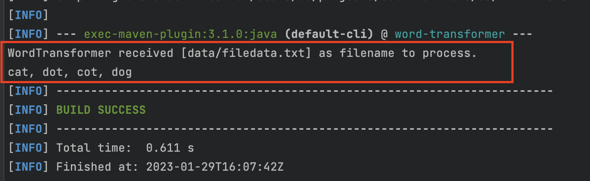
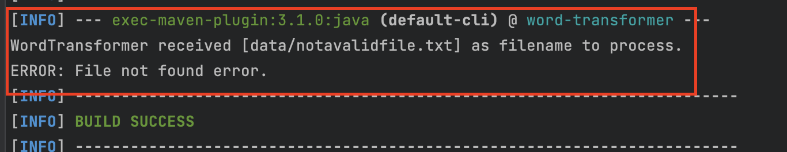
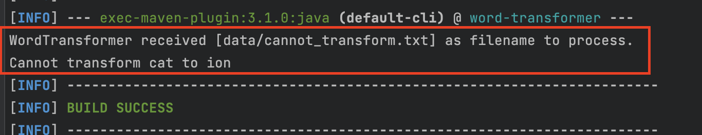

># Task 
>Given the following list of words
> > {ant, bat, cat, cot, cut, dog, dot, hen, pig, rat}
>
>The word “cat” can be transformed to the word “dog” in three steps if you are allowed to change at most one character in every step
>
>>Step 1: cat => cot
>>
>>Step 2: cot => dot
>>
>>Step 3: dot => dog
>
>Note, there might be other ways to transform cat into dog, but the above solution is the quickest as it takes the fewest number of steps.
>
>Also note that every intermediate word used in the transformation (i.e., cot & dot) should be present in the given list of words. So, a transformation like cat => cot => cog => dog is invalid as cog is not part of the valid list of words.
>
>Finally, it might not be possible always to transform one word to another.
>
>## Problem Statement:
>Implement a Java program that will print the transformation steps required to convert one word to another word.
>
>### Input:
>Your program will accept a filename as command line argument. You can assume that the file will be present in the same folder from where your program will be executed. The file will be a text file of the following structure.
>
>>Line 1: start_word, end_word
>>
>>Line 2: Comma separated list of all the valid words
>
>#### Expected output:
>You program should write the answer to the standard input (using System.out.print()) in the following format
>
>>start_word, word_1, word_2, word_3,…end_word
>
>If the start_word cannot be transformed to the end_word, then your program should print
>
>>Cannot transform start_word to end_word”
>
>In case of any errors are exception scenarios (like file not found, for example), your program should print the text “ERROR:“ followed by some user friendly description of the error / exception. For example
>
>>ERROR: File not found

# Solution Approach
- Understand the algorithm being implied from the task
- Implement quick test to demonstrate 
  - understanding of algorithm
  - file processing
    >Your program will accept a filename as command line argument
- State improvements to code implementation

## Assumptions
- All files to be processed must follow rules mentioned in the _Input_ section
- All words in the _list of all valid words_ are in lowercase
  - Why I have not added any ignore case checks; 
  - Also, why I have not transformed these list of words into lowercase

## Improvements
- Use a dependency injection framework for injecting dependencies
- Use a logging library instead of `Systmem.out.println`

# Running Project

## Pre-requisites
- Java 17+ installed

## SetUp
- Extract `word-transformer.zip`
- Change directory into `word-transfer` directory
  - Main class is located in `com.sg.WordTransformer`

### On Windows
- Run below command
  ```bash
  mvnw.cmd clean compile exec:java -Dexec.arguments="data/filedata.txt"
  ```
  
### On Linux (or MacOS)
- Run below command
  ```bash
  ./mvnw clean compile exec:java -Dexec.arguments="data/filedata.txt"
  ```
  
## Run screenshots
- Successful transformation


- Unsuccessful (with none existent file name passed)


- Unsuccessful (with cannot transform error)
